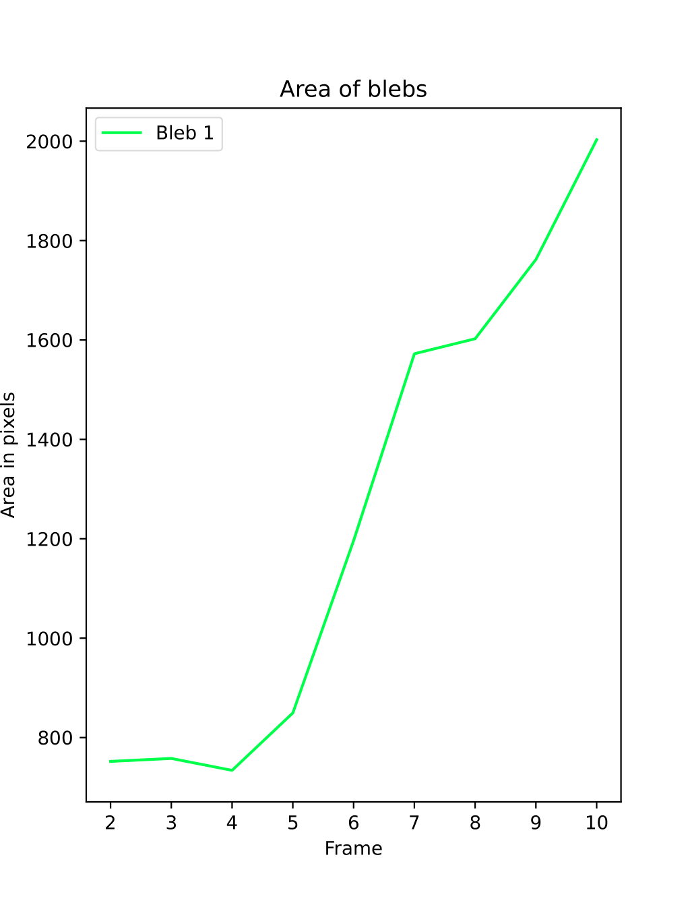
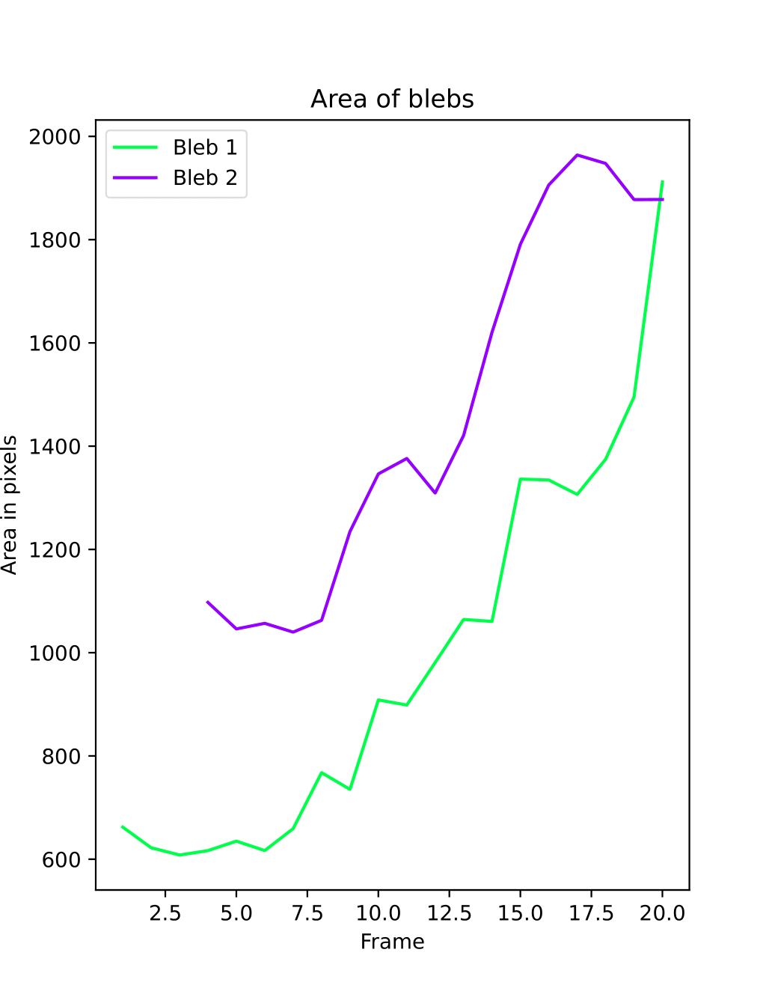

# Tracking of cell blebbing in biomedical images
This is the final project in the course [Bioimage Informatics](https://edu.epfl.ch/coursebook/en/bioimage-informatics-BIO-410) at EPFL. 

Blebs are bulges in the plasma membrane of cells and can be seen in cell apoptosis, cell displacement and cell division amongst others. We seek automatic tracking of growth and displacement of such blebs through a series of medical images. We prepocess images and use active contour to track the blebs.

Some results:

  
   

  
   

# Setup
This setup assumes you have Python 3 and Jupyter installed

Open a terminal and go in the project directory.

Create a virtual environment for python:
`python -m venv blebbing_venv`

Activate the virtual environment

Linux:
`source blebbing_venv/bin/activate`

Windows:
`blebbing_venv\Scripts\activate`

nstall the required libraries:
`pip install -r requirements.txt`

Create the kernel for jupyter:
`python -m ipykernel install --user --name=blebbing_venv`

Facultative: get additionnal data
Download the files from the drive and put them in the data folder,
following the structure of the data already available

# Execution

Run the notebook:
`jupyter notebook`

Open the juypter notebook `blebbing.ipynb`.

Select the kernel created in the setup, in `Kernel > Change kernel`

Execute each cell one after the other. Some will allow you to select 
different parameters.

The cell under "Image Selection", will display a dropdown menu
 with the different image available and allow you to select the
 one to work on. (Given you added the other data from the drive)

The cell of code under "Bleb Selection" will open a window that will allow 
you to select the blebs you want to track. Navigate between the frames of
the selected image with whe `Previous Frame` and `Next Frame` buttons.
Depending of the browser, the window may open in background, check your taskbar !

Once you selected the frame from which you want to track the first bleb,
you can directly draw on the image with the cursor to circle the bleb.
Hit `save current selection and start new` to save the selection and 
make another, or `save current selection and finish` once you selected
all the blebs you wanted. Blebs can start on different frames.
If you made a mistake while circling a bleb, you can clear your last
selection with `clear current selection and start new`

Once you selected the blebs you wanted, run the remaining cells.

The provided images have a lot of frames and have a high resolution. Therefore,
the tracking may take a few minutes depending on the size of the input. It is
advised to not track too much blebs at the same time.
If you want to speedup the process, you can edit the `max_frames` parameter
in the cell under "Image Selection" to perform the tracking on a subset of the
frames of the image only.
